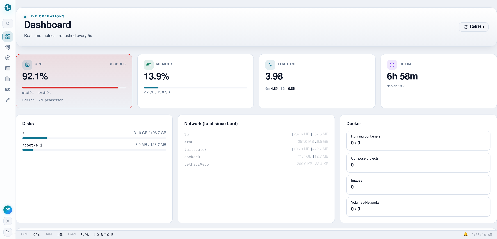
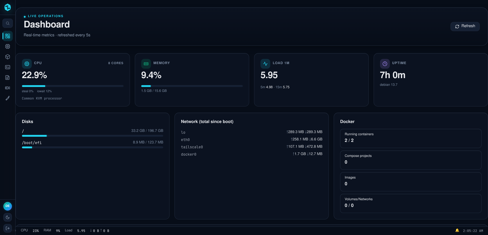
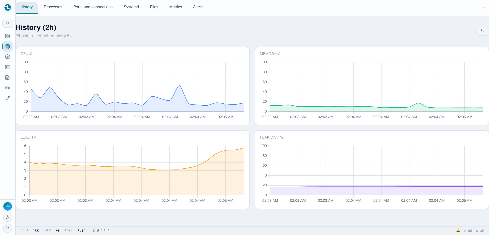
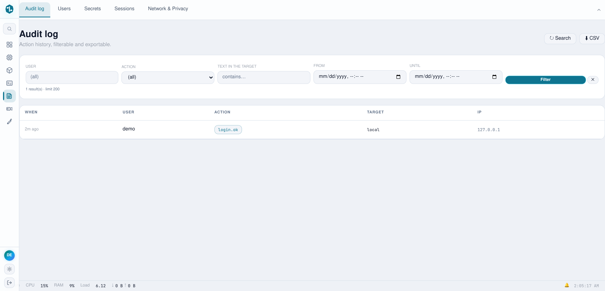
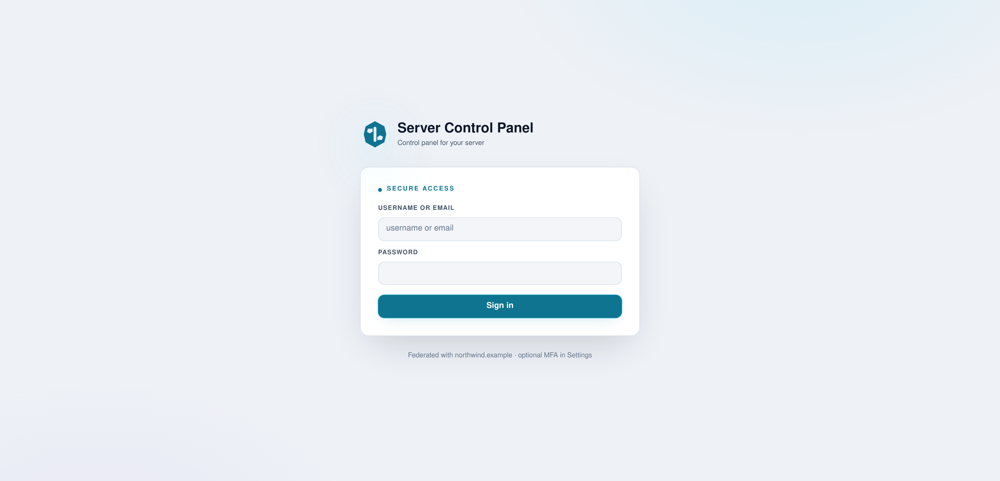

# server-control-panel

[](https://github.com/eranoix/server-control-panel/actions/workflows/ci.yml) [](LICENSE)   

**A web and phone dashboard to look after a Linux server without living in the terminal.**

*In plain words:* Looking after a server usually means typing commands into a plain text window, one at a time. This project puts all of that on one web page and in a phone app instead. From there you can see what is running, open and edit files, restart programs and schedule jobs, without memorizing commands. It is for anyone who keeps a server running, for a small team or for themselves. A demo version starts with a single command, so you can click around without a real server.

A single Go binary that replaces SSH, a terminal multiplexer, `docker`, `crontab`,
`journalctl` and a folder of shell scripts with one web page, plus a native
Android client that speaks the same API.

<p align="center"> </p>

## Try the demo

All you need is Docker with the Compose plugin (`docker compose version` should
answer). Nothing else is installed on your machine: Go and the build happen
inside the image. From a clone of this repository:

```bash
docker compose up
# then open http://localhost:8765 and sign in with  demo / demo
```

The first run compiles the binary inside the image, which takes a few minutes.
If port 8765 is already taken, the same demo runs on 18767 with
`docker compose -f docker-compose.yml -f test/port-override.yml up`
(Compose 2.24 or newer). Stop it with Ctrl+C, or `docker compose down`.

The demo is read-only on purpose: writes, terminals and shell access are
refused, and it resets itself on every restart.

<picture><source media="(prefers-color-scheme: dark)" srcset="docs/screenshots/02-history-dark.png"></picture>

<picture><source media="(prefers-color-scheme: dark)" srcset="docs/screenshots/03-audit-log-dark.png"></picture>

<picture><source media="(prefers-color-scheme: dark)" srcset="docs/screenshots/04-login-dark.png"></picture>

---

## Why this exists

Administering a server means keeping a dozen tools in your head and a terminal
open on every one of them. This collapses that into one page, and, more to the
point, into one artifact: a static binary with the entire front end compiled
into it. Deployment is copying a file.

The interesting parts are not the panels. They are the decisions underneath.

## Four decisions worth reading the code for

**Terminal sessions outlive the process that serves them.**
A PTY is allocated per session and attached to a detached multiplexer, so
restarting the control plane does not kill a running job. Reattaching replays
the live screen instead of starting a blank one. Rendering is *per client*: two
viewers of the same session at different window sizes each get output composed
for their own viewport, rather than the session collapsing to the smallest
connected screen.
→ `internal/pty/`

**Every subsystem fails soft, on purpose.**
Containers, hypervisor inventory, messaging, video, speech: each is opened
lazily and degrades to a disabled panel when its dependency is absent. A missing
dependency logs one line; it never stops the process from starting. A control
plane that refuses to boot because a monitored service is down is useless
exactly when you need it, since that is when you open it.
→ `internal/api/api.go`

**The public demo denies by default, at one choke point.**
`DEMO_MODE` installs a single wrapper in `Router.ServeHTTP` and refuses
everything except an explicit allowlist. Three independent rules: method
(GET/HEAD plus login), WebSocket upgrade (checked by header, so it holds on any
path), and path family. 266 routes are registered today; a denylist would have
meant the 267th arrived unguarded.
→ `internal/api/demo_mode.go`

**There is a way back in when the panel will not start.**
A separate CLI administers the same data directory with no web UI: reset
credentials, inspect state, rotate secrets. The failure it exists for is the one
where a web-only administration story leaves you locked out of your own machine.
→ `cmd/vpsmctl/`

## Stack

| | |
|---|---|
| Backend | Go 1.25, standard-library `net/http`; the one framework is huma v2, and only for the mobile BFF's OpenAPI surface |
| Front end | Alpine.js, xterm.js, Monaco, Chart.js, no build step for app code |
| Storage | JSON files + SQLite (pure-Go driver, so `CGO_ENABLED=0` holds) |
| Auth | JWT in an HttpOnly cookie, WebAuthn passkeys, optional TOTP |
| Mobile | Kotlin + Compose, 17-module Gradle composite build |
| Image | Static binary on Alpine; the 23 MB front end ships inside it via `go:embed` |

### Languages

Thirteen of them, because a control plane is not one program. The percentages are
what GitHub counts, after `.gitattributes` corrects what its heuristics get
wrong here: the front end lives under a directory called `vendor/` (that is
where the asset server reads from) and was being discarded as third-party
code, and the Gradle build and Android resources are classified as data rather
than as source.

| | | |
|---|---|---|
| Go | 45.4% | The control plane. 65 packages, almost all of it bare `net/http` |
| Kotlin | 25.5% | Android client: Compose UI and a VT terminal engine |
| JavaScript | 15.5% | Panel front end, plus browser tests driven over CDP |
| HTML | 10.7% | `index.html` is the panel: one Alpine template, not a shell |
| Shell | 1.4% | Build, release and test harnesses |
| Gradle (Kotlin DSL) | 0.5% | 17-module composite build with a convention plugin |
| XML | 0.4% | Android manifests, themes, file provider and backup rules |
| C++ | 0.3% | JNI bridge from Kotlin to `libghostty-vt` |
| Makefile | 0.1% | Top-level targets and the NDK build for the patch engine |
| Dockerfile | <0.1% | Multi-stage; the final image is a static binary on Alpine |
| Python | <0.1% | Doc-structure check and a VT session replayer |
| CMake / Go Template | <0.1% | Native terminal build; TURN server config |

Third-party code shipped in-tree (Monaco, xterm.js, mermaid, zstd, HDiffPatch)
is marked vendored and excluded, which is why 19 MB of JavaScript and 2.3 MB of
C do not appear above. Neither does `tailwind.css`: it is build output.

## Android client

`android/` is a standalone Gradle composite build with its own terminal engine:
a VT parser driving a Compose renderer, rather than a web view around the same
page. Point it at a server with one property:

```properties
# android/gradle.properties
vpsmanager.defaultServerUrl=https://your-server.example
```

The prebuilt `libghostty-vt` static libraries are not committed here (they carry
absolute build paths and 30 MB of debug sections). Build them from upstream, or
run the rest of the modules without `:terminal-engine`.

## Documentation

`docs/` is the written record of the Android client: what was built, what broke
and why each structural decision is the one it is. It is the part of this
repository that took longest and is hardest to reconstruct from the code.

| | |
|---|---|
| [Technical record](docs/android-technical-record.md) | The app end to end: every module, every screen, and the failures that shaped them |
| [UX research](docs/android-ux-research.md) | The market and platform research behind the screens, every claim sourced |
| [Incremental updates](docs/android-incremental-updates.md) | The patch channel, with the measured numbers |
| [Signing and key custody](docs/android-signing-keystore.md) | Release key custody, and the drill that proved the recovery path |
| [Release pipeline](docs/android-release-pipeline.md) · [F-Droid repo](docs/android-fdroid-repo.md) | How a build becomes something a phone will install |
| [Push without Google](docs/android-unifiedpush.md) | UnifiedPush, and what it costs to not depend on FCM |
| [Developer verification](docs/android-developer-verification.md) · [Dev key](docs/android-dev-key.md) | Distributing outside a store, and the throwaway key for it |

## Running it for real

This gives you the full thing: writes, terminals, container exec. It also means
anyone who can reach the port can try to sign in, so keep it off the public
internet or behind your own TLS proxy.

In `docker-compose.yml`:

1. Delete the whole `environment:` block (it only holds `DEMO_MODE`).
2. Under `tmpfs:`, delete the `/app/data` line and keep `/tmp`. That tmpfs is
   what makes the demo forget everything on restart.
3. Give the data directory a volume so it survives restarts:

   ```yaml
   services:
     server-control-panel:
       # ...everything else as it was...
       volumes:
         - panel-data:/app/data

   volumes:
     panel-data:
   ```

Then start it and read the admin password it generated:

```bash
docker compose up -d
docker compose exec server-control-panel cat /app/data/INITIAL_CREDENTIALS.txt
```

Sign in as `admin` with that password. The demo account does not exist
outside demo mode: the seed that creates it is only copied when `DEMO_MODE` is
set.

To have the container panel show your actual containers, mount the Docker
socket and let the unprivileged user in the image (uid 10001) read it by
adding the socket's group:

```yaml
    volumes:
      - panel-data:/app/data
      - /var/run/docker.sock:/var/run/docker.sock:ro
    group_add:
      - "999"   # the output of: stat -c %g /var/run/docker.sock
```

Configuration is one JSON file (`VPSM_CONFIG`, default
`/opt/panel/data/config.json`; the image sets it to `/app/data/config.json`).
The first start without one generates it, including the random admin password
written to `INITIAL_CREDENTIALS.txt` beside it.

## Tests

You need Go 1.25 or newer (`go version`). The toolchain line in `go.mod` makes
an older Go download the right one by itself.

```bash
go test $(go list ./... | grep -v /internal/webassets)
```

That is exactly what CI runs: the 45 packages whose tests need nothing but Go.
47 packages have tests in total. Six tests cover the demo gate alone, including
one asserting that an *unknown* route is denied, the property an allowlist has
and a denylist cannot.

The other two packages hold front-end tests that render pages in a real
browser. They need Node.js with npm, Google Chrome or Chromium, and `dtach`
(one of them shares a terminal session between two windows, and terminal
sessions are dtach sessions):

```bash
make tools        # installs esbuild and playwright-core into .tools/
go test ./...     # everything, browser tests included
```

Without `make tools` those tests fail loudly rather than skip, which is
deliberate: the screens they cover broke twice in production while a skipped
test reported green. The same goes for a missing `dtach`.

A few tests read the machine around them (a CLI binary found on the `PATH`, a
system configuration directory) and can fail on a developer box that happens to
have those installed. CI runs on a clean runner, where they pass.

## Honest notes

- The UI is being translated from Portuguese; some panels are still in the
  original language.
- Inside the demo container some panels have nothing to show: the Docker panel
  reports that it cannot reach the daemon (there is no socket in there) and
  the disk card is empty. That is the fail-soft behaviour described above,
  not a broken build.
- The demo seeds fabricated inventory and reads live CPU/memory from its own
  container, so those numbers are real but describe the demo host.
- This is a working system, not a product. It assumes one operator who trusts
  the machine it runs on.
